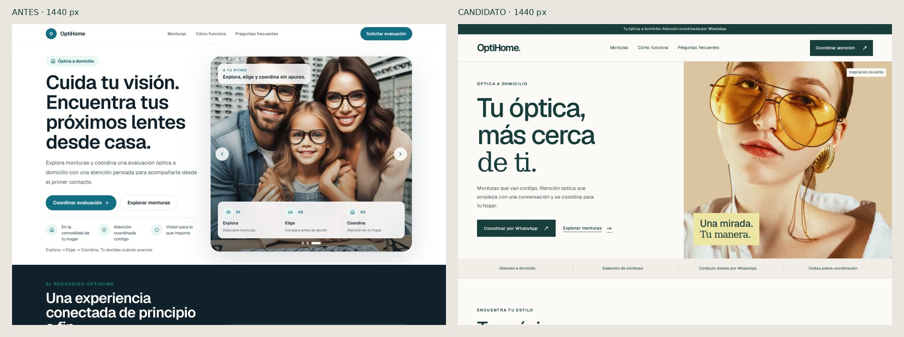
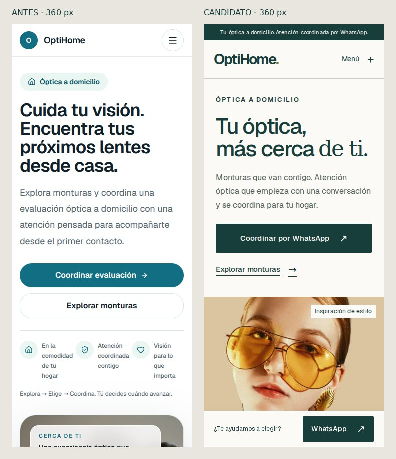

# QA del candidato comercial

Base comparada: `8bf33df537248f6ebdcaaa76db8575e91e9222d9`.

## Comprobaciones locales

| Control | Resultado |
|---|---|
| ESLint | PASS, sin warnings de código |
| TypeScript | PASS |
| Build de producción | PASS, rutas estáticas |
| Contratos nuevos | 4/4 PASS |
| Contratos de código heredados | 10/10 PASS; hashes internos preservados |
| Dependencias | npm audit: 0 vulnerabilidades |
| Chromium: home, catálogo, privacidad, 404 | 16/16 PASS (360, 390, 430, 1440 px) |
| Axe WCAG 2 A/AA y 2.1 AA | 8/8 análisis sin infracciones detectadas |
| Consola | Sin errores de página ni errores de consola inesperados |
| Imágenes y overflow | Cero imágenes rotas; cero desbordamientos horizontales |
| Interacción | Menú, Escape, devolución de foco, navegación, FAQ por teclado, filtros, vacío y reset PASS |
| WhatsApp | 21 enlaces de catálogo comprobados: número, mensaje contextual, target y rel seguros; no se enviaron mensajes |
| Enlaces | 13 destinos y redirecciones internas PASS |
| Try-on público | Rutas inexistentes y query parameters no lo activan; ningún canvas, video o selector de archivo |
| Movimiento reducido | PASS |
| SEO | Canonical, descripción, sitemap, robots, icono y OpenGraph PASS |

Las expectativas de texto de cuatro workflows heredados se actualizaron para la arquitectura comercial solicitada. Se mantiene la comprobación del código interno; las expectativas positivas de SpatialOptics en home se sustituyen por ausencia. El workflow MK1 ejecuta la batería completa y publica capturas/reportes como artefactos de cada ejecución.

## Comparación visual

Se inspeccionaron capturas de todas las rutas públicas en desktop y móvil, además de las redirecciones. La home inicial repetía el recorrido y mostraba una escena técnica. El candidato prioriza rostro, monturas y coordinación. El catálogo pasa de carrusel a grid filtrable sin depender de animaciones.

Los elementos fijos de contacto aparecen a la altura del viewport al capturar una página completa; se revisaron también capturas de viewport y navegación real para comprobar que no ocultan el contenido al final del scroll.

## Bundle y estabilidad

Medición reproducible: sumar los chunks JavaScript de los `script src` del HTML inicial de home y comprimir cada uno con gzip. No representa el total de imágenes o HTML ni incluye el módulo externo de Three.js que cargaba la versión anterior.

| Medida | Inicial | Candidato | Cambio |
|---|---:|---:|---:|
| JS sin comprimir | 760.554 bytes | 593.817 bytes | −21,9% |
| JS gzip | 239.321 bytes | 184.357 bytes | −23,0% |
| Three.js externo en navegación comercial | Sí | No | Eliminado |

No hay solicitudes a Three.js, TensorFlow o MediaPipe en las rutas comerciales. Sus dependencias permanecen para conservar la implementación interna.

CLS local observado: 0 en home y catálogo en los cuatro anchos. Se guardan LCP y CLS por ruta en el reporte. El servidor local, caché y ausencia de throttling impiden usarlos como métricas de usuarios reales o puntuaciones Lighthouse. No se atribuyen mejoras de Core Web Vitals de campo.

## Evidencia reproducible y límites

- [Reporte Chromium local](evidence/local-browser-report.json)
- [Bundle inicial](evidence/baseline-bundle.json)
- [Contratos heredados](evidence/legacy-contracts.json)
- Repetir con los comandos del README; el workflow captura el resultado del SHA publicado.
- La inspección móvil usa viewports Chromium; no sustituye una prueba en un iPhone/Android físico ni un lector de pantalla real.
- Las fotografías heredadas y los ocho estilos no son evidencia de inventario, clientes o profesionales. Los pendientes comerciales y de procedencia están en OWNER-INVENTORY.md.
- No se hizo merge ni despliegue de producción. El preview y las comprobaciones remotas se vinculan en el PR.
